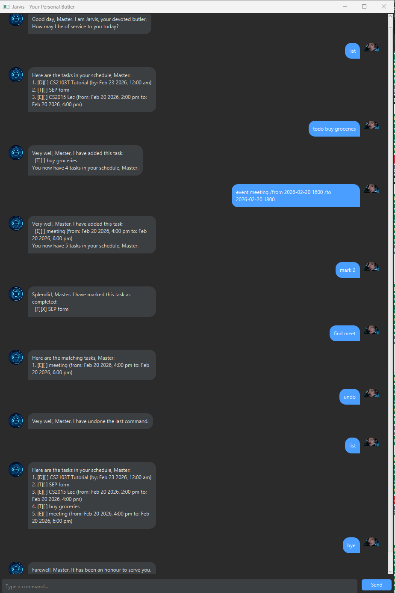

# Jarvis User Guide



**Jarvis** is your devoted butler - a desktop task management application that helps you keep track of your todos, deadlines, and events. Jarvis uses a Command Line Interface (CLI) style interaction within a graphical interface, making it fast and efficient for users who prefer typing.

## Quick Start

1. Ensure you have Java 17 or above installed on your computer.
2. Download the latest `jarvis.jar` from the releases page.
3. Copy the file to the folder you want to use as the home folder for Jarvis.
4. Double-click the file to start the app. A GUI should appear with a welcome message from Jarvis.
5. Type commands in the text field and press Enter or click Send to execute them.

## Features

### Adding a todo: `todo`

Adds a simple task without any date/time attached.

Format: `todo DESCRIPTION`

Example: `todo read book`

```
Very well, Master. I have added this task:
  [T][ ] read book
You now have 1 tasks in your schedule, Master.
```

### Adding a deadline: `deadline`

Adds a task that needs to be done before a specific date/time.

Format: `deadline DESCRIPTION /by DATE`

- Date format: `yyyy-MM-dd` or `yyyy-MM-dd HHmm`

Example: `deadline submit report /by 2026-02-25`

```
Very well, Master. I have added this task:
  [D][ ] submit report (by: Feb 25 2026, 12:00 AM)
You now have 2 tasks in your schedule, Master.
```

### Adding an event: `event`

Adds a task that starts and ends at specific times.

Format: `event DESCRIPTION /from START /to END`

- Date format: `yyyy-MM-dd` or `yyyy-MM-dd HHmm`

Example: `event team meeting /from 2026-02-20 1400 /to 2026-02-20 1600`

```
Very well, Master. I have added this task:
  [E][ ] team meeting (from: Feb 20 2026, 2:00 PM to: Feb 20 2026, 4:00 PM)
You now have 3 tasks in your schedule, Master.
```

### Listing all tasks: `list`

Shows all tasks in your task list.

Format: `list`

```
Here are the tasks in your schedule, Master:
1. [T][ ] read book
2. [D][ ] submit report (by: Feb 25 2026, 12:00 AM)
3. [E][ ] team meeting (from: Feb 20 2026, 2:00 PM to: Feb 20 2026, 4:00 PM)
```

### Marking a task as done: `mark`

Marks a specified task as completed.

Format: `mark INDEX`

Example: `mark 1`

```
Splendid, Master. I have marked this task as completed:
  [T][X] read book
```

### Unmarking a task: `unmark`

Marks a specified task as not done.

Format: `unmark INDEX`

Example: `unmark 1`

```
Understood, Master. I have reverted the task status:
  [T][ ] read book
```

### Deleting a task: `delete`

Removes a task from your task list.

Format: `delete INDEX`

Example: `delete 1`

```
As you wish, Master. I have removed this task:
  [T][ ] read book
You now have 2 tasks remaining, Master.
```

### Finding tasks: `find`

Finds tasks whose descriptions contain the given keyword.

Format: `find KEYWORD`

Example: `find report`

```
Here are the matching tasks, Master:
1. [D][ ] submit report (by: Feb 25 2026, 12:00 AM)
```

### Undoing last command: `undo`

Reverts the most recent command that modified the task list.

Format: `undo`

```
Very well, Master. I have undone the last command.
```

### Exiting the program: `bye`

Exits the application.

Format: `bye`

```
Farewell, Master. It has been an honour to serve you. Until next time.
```

## Command Summary

| Action | Format | Example |
|--------|--------|---------|
| Add todo | `todo DESCRIPTION` | `todo read book` |
| Add deadline | `deadline DESCRIPTION /by DATE` | `deadline homework /by 2026-02-25` |
| Add event | `event DESCRIPTION /from START /to END` | `event meeting /from 2026-02-20 1400 /to 2026-02-20 1600` |
| List | `list` | `list` |
| Mark | `mark INDEX` | `mark 1` |
| Unmark | `unmark INDEX` | `unmark 1` |
| Delete | `delete INDEX` | `delete 1` |
| Find | `find KEYWORD` | `find book` |
| Undo | `undo` | `undo` |
| Exit | `bye` | `bye` |

## Data Storage

Task data is automatically saved to `./data/jarvis.txt` after each command. There is no need to save manually.
